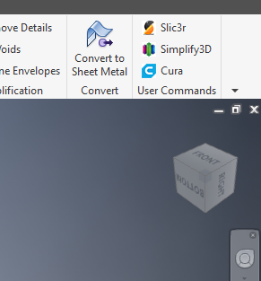

* Open Default.ivb in the text editor of your choice
* Select all and copy
* In Inventor go to `Tools -> VBA Editor` and paste into Default.ivb
* Take note of the location of Default.ivb and put the icons in the same folder

See [here](http://docs.autodesk.com/INVPRO/2010/ENU/Autodesk%20Inventor%202010%20Help/index.html?url=WS1a9193826455f5ff5f7e8f111d485187134b3-procedure3.htm,topicNumber=d0e58956) for instruction on how to add macro buttons to the user command panel.

